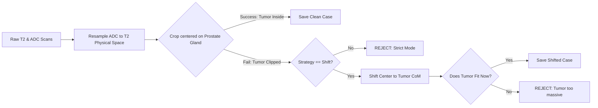

# CS7642 Prostate Cancer Detection

## 1. Getting Started
1. Clone the repository locally.
2. Create a virtual environment: `python -m venv .venv`
3. Activate the environment:
   * **Mac/Linux:** `source .venv/bin/activate` 
   * **Windows:** `venv\Scripts\activate`
4. Install dependencies: `pip install -r requirements.txt`
5. Install the project locally: `pip install -e .`

---

## 2. Configuration (`config/dataset.yaml`)
All hyperparameters for data preprocessing and ML splitting are centralized in `config/dataset.yaml`. 
Adjust `crop_size`, `strategy`, and train/val/test splits here before running the pipeline.

---

## 3. Preprocessing Pipeline (`scripts/preprocess_dataset.py`)
To solve the spatial variance in MRI scans, we center the prostate and extract normalized physical tensors across T2 and ADC modalities.

### Key Design Decisions:
* **Anatomical Centering:** We use the AI-generated Whole Gland mask (**Bosma22b**) to calculate the Center of Mass (CoM). This ensures the crop is centered on the organ, not just the tumor, providing consistent anatomical context.
* **Dynamic Resolution:** Controlled via `crop_size` in the YAML (Default 128x128). At ~0.5mm/pixel, a 128 crop safely encapsulates the average prostate (~40-50mm) plus a healthy margin.
* **Registration:** ADC images (lower resolution) are resampled into the T2 reference space before cropping to ensure 1:1 pixel alignment for the Cross-Attention bottleneck.

### Crop Strategies:
We provide two modes to facilitate ablation studies on spatial alignment:
1.  **Strict (Default):** Rejects any patient where the bounding box clips the tumor. 
    * *Use case:* When absolute anatomical centering is required.
2.  **Shift:** If a tumor is clipped, the script recalculates the CoM based on the tumor and shifts the box.
    * *Use case:* Maximizing training data and testing robustness to off-center anatomy.



**To run the extractor:**
```bash
python scripts/preprocess_dataset.py
```
*(Outputs raw tensors and a master inventory to `data/`)*

---

## 4. Manifest Generation (`scripts/generate_splits.py`)
Once preprocessing is complete, this script reads `dataset.yaml`, balances the healthy (negative) and cancerous (positive) classes, and generates the final train/val/test manifest for the PyTorch DataLoader.

**To generate the PyTorch splits:**
```bash
python scripts/generate_splits.py
```
*(Outputs `ml_manifest_[strategy]_[size].json` to `data/`)*